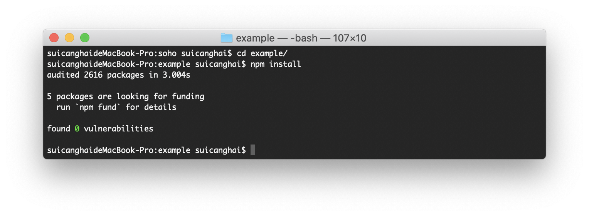
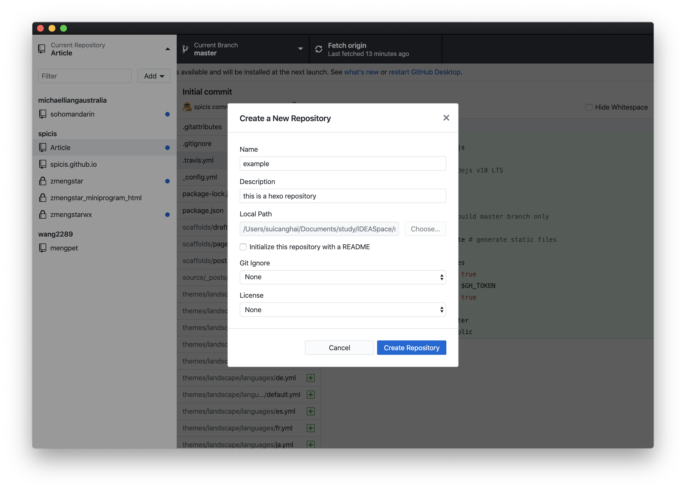
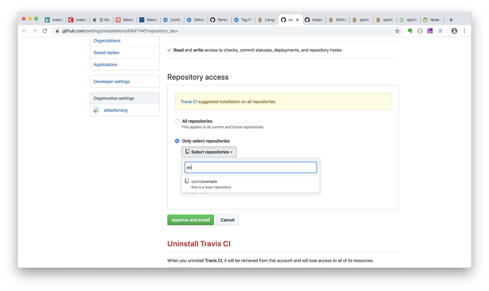

# Hexo + Github pages guide
配置的时候可以参考以下几个网站的指引
1. hexo 安装步骤 [https://hexo.io/docs/](https://hexo.io/docs/)
2. hexo和github pages的配置 [https://hexo.io/docs/github-pages](https://hexo.io/docs/github-pages)
3. hexo自动化部署工具travis ci的配置 [https://travis-ci.com/](https://travis-ci.com/)

# 安装Node.js 和 Git

# 安装hexo

$ npm install hexo


# 在合适的目录下创建hexo的一个项目

$ cd <yourfolder>

$ hexo init <folder>
$ cd <folder>
$ npm install


创建完后会看到有这些文件

.
├── _config.yml
├── package.json
├── scaffolds
├── source
|   ├── _drafts
|   └── _posts
└── themes


# 配置github pages
可以参考这个[https://hexo.io/docs/github-pages](https://hexo.io/docs/github-pages)

## 把刚才创建的hexo提交到github上，作为blog的repository
我用的是github desktop

这一步点击create new repository

# 配置Travis CI
Add [Travis CI](https://github.com/marketplace/travis-ci) to your account.
Go to [Applications settings](https://github.com/settings/installations), configure Travis CI to have access to the repo.

打开travis管理repositories的页面 [Travis manage](https://travis-ci.com/account/repositories)
点击Manage repositories on Github

完成后页面会自动回到travis管理页面

# 创建一个github token
在这里创建token，选中repo scope，并且把token value记下来 [New Token](https://github.com/settings/tokens)

# 在travis中加上刚才配置的token
选择之前添加的repository，点击setting

在下面加上github token，name一定要是GH_TOKEN.
put GH_TOKEN as name and paste the token onto value.

# 在你的repo中增加一个.travis.yml文件
Add .travis.yml file to your repo (alongside _config.yml & package.json) with the following content:

sudo: false
language: node_js
node_js:
  - 10 # use nodejs v10 LTS
cache: npm
branches:
  only:
    - master # build master branch only
script:
  - hexo generate # generate static files
deploy:
  provider: pages
  skip-cleanup: true
  github-token: $GH_TOKEN
  keep-history: true
  on:
    branch: master
  local-dir: public


# 修改__config.yml文件

# commit and push

提交之后travis会自动build，可以到travis的管理网页上看build进度
Installing deploy dependencies 
Deploying application 
Done. Your build exited with 0.
说明成功了

# 在github上，切换repository到gh-pages branch

# 在chrome上访问你的blog
访问url是 https://yourname.github.io/yourrepo
比如我创建的是[https://spicis.github.io/example/](https://spicis.github.io/example/)

# 更换theme

$ cd <folder>
$ git clone https://github.com/theme-next/hexo-theme-next themes/next	


修改_config.yml文件，把theme改成next

commit and push，等travis build成功后，就可以看到新的theme了
